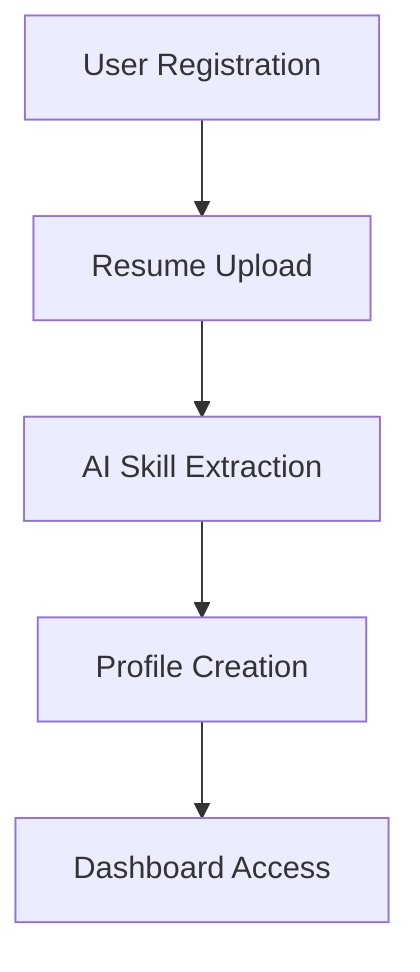
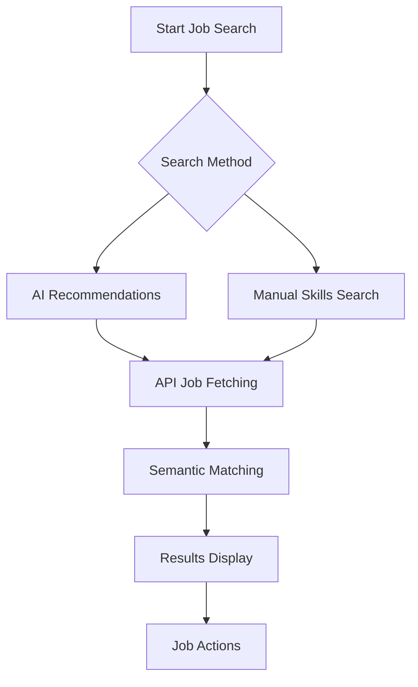
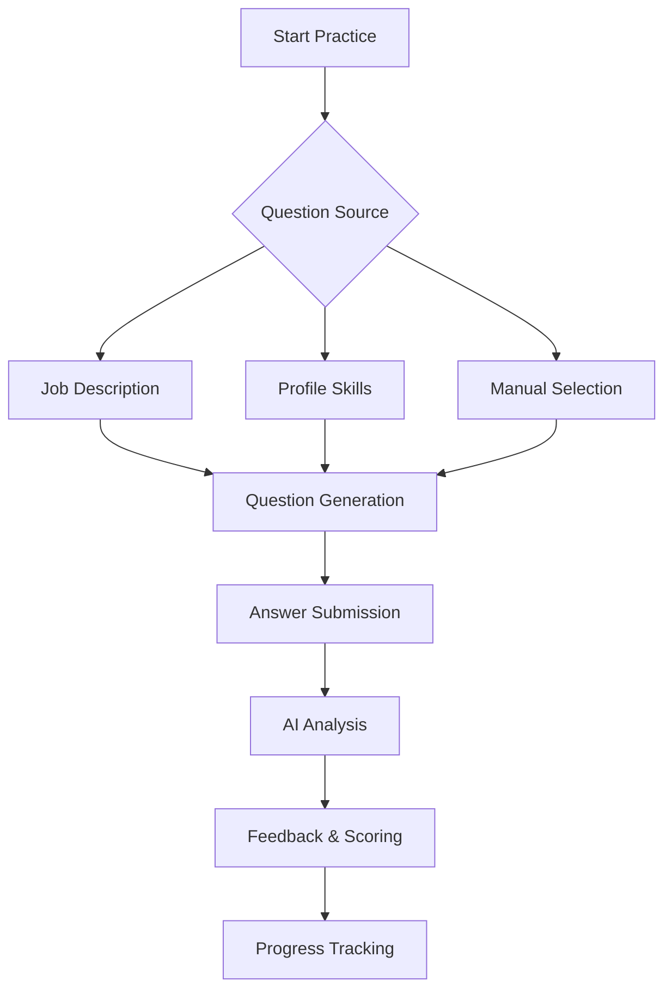
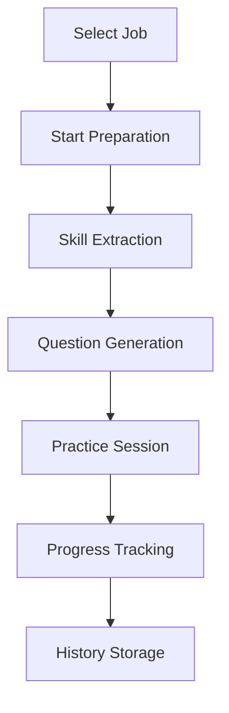

# AI Career Hub - Complete Project Documentation

## 📋 Table of Contents
- [Project Overview](#project-overview)
- [Features](#features)
- [Technology Stack](#technology-stack)
- [Installation Guide](#installation-guide)
- [Project Structure](#project-structure)
- [Workflow](#workflow)
- [API Documentation](#api-documentation)
- [Configuration](#configuration)
- [Usage Guide](#usage-guide)
- [Troubleshooting](#troubleshooting)

## 🚀 Project Overview

**AI Career Hub** is an intelligent job search and career development platform that uses advanced AI (Sentence-BERT) for semantic job matching, interview practice with instant feedback, and personalized job preparation. The system integrates with real job APIs to provide live job listings and uses machine learning to match users with relevant opportunities.

## ✨ Features

### 🤖 AI-Powered Job Matching
- **Semantic Analysis**: Uses Sentence-BERT to understand context and meaning beyond keywords
- **Real Job APIs**: Integrates with Adzuna and JSearch for live job listings
- **Smart Scoring**: Calculates match scores based on skills, experience, and job requirements
- **Multiple Search Modes**: AI recommendations and manual skills search

### 🎯 Interview Practice
- **AI-Generated Questions**: Custom questions based on job descriptions and skills
- **Instant Feedback**: Real-time analysis of answers using semantic similarity
- **Skill-Based Practice**: Focus on specific technical and behavioral skills
- **Progress Tracking**: Monitor performance across different skill categories

### 💼 Job Preparation
- **Role-Specific Preparation**: Custom preparation for specific job applications
- **Question Generation**: Tailored interview questions for target positions
- **Preparation History**: Track your preparation across multiple jobs

### 👤 User Management
- **Resume Analysis**: AI-powered resume parsing and skill extraction
- **Profile Management**: Store skills, experience, and preferences
- **Application Tracking**: Monitor job applications and saved jobs
- **Activity History**: Comprehensive tracking of user activities

## 🛠 Technology Stack

### Backend
- **Flask** - Python web framework
- **SQLite** - Database for user data and job storage
- **Sentence-BERT** - Semantic text embeddings for AI matching
- **scikit-learn** - Machine learning and similarity calculations
- **PyPDF2/docx** - Resume text extraction

### Frontend
- **HTML5/CSS3** - Responsive web interface
- **Vanilla JavaScript** - Dynamic client-side functionality
- **Font Awesome** - Icons and UI elements

### APIs & Services
- **Adzuna API** - Job listings
- **JSearch API** - Additional job sources
- **RESTful API** - Custom backend API

### AI/ML Components
- **Sentence Transformers** - Text embeddings
- **Cosine Similarity** - Semantic matching
- **Pattern Matching** - Skill extraction and keyword analysis

## 📥 Installation Guide

### Prerequisites
- Python 3.8 or higher
- pip (Python package manager)
- Git

### Step-by-Step Installation

#### 1. Clone the Repository
```bash
git clone <repository-url>
cd ai-career-hub
```

#### 2. Create Virtual Environment
```bash
# On Windows
python -m venv venv
venv\Scripts\activate

# On macOS/Linux
python3 -m venv venv
source venv/bin/activate
```

#### 3. Install Dependencies
```bash
pip install -r requirements.txt
```

#### 4. Environment Configuration
Create a `.env` file in the project root:
```env
FLASK_SECRET_KEY=your-secret-key-here
ADZUNA_APP_ID=your-adzuna-app-id
ADZUNA_APP_KEY=your-adzuna-app-key
JSEARCH_API_KEY=your-jsearch-api-key
```

#### 5. Database Initialization
```bash
# The database will be automatically created when you first run the application
python app.py
```

#### 6. Run the Application
```bash
python app.py
```

The application will be available at: `http://localhost:5000`

## 📁 Project Structure

```
ai-career-hub/
├── app.py                 # Main Flask application
├── requirements.txt       # Python dependencies
├── career_hub.db         # SQLite database (created automatically)
├── uploads/              # Resume upload directory
├── templates/            # HTML templates
│   └── index.html        # Main frontend template
├── README.md             # This file
└── venv/                 # Virtual environment (created during setup)
```

## 🔄 Workflow

### 1. User Registration & Setup


### 2. Job Search Process


### 3. Interview Practice Flow


### 4. Job Preparation Workflow


## 📡 API Documentation

### Authentication Endpoints

#### POST `/api/register`
Register a new user
```json
{
    "name": "John Doe",
    "email": "john@example.com",
    "password": "securepassword"
}
```

#### POST `/api/login`
User login
```json
{
    "email": "john@example.com",
    "password": "securepassword"
}
```

#### POST `/api/logout`
User logout

### Profile Management

#### GET/POST `/api/profile`
Get or update user profile

#### POST `/api/upload-resume`
Upload and analyze resume
- Supports: PDF, DOCX, TXT
- Extracts: Skills, Experience, Contact Info

### Job Recommendations

#### GET `/api/auto-recommendations`
Get AI-powered job recommendations based on user profile

#### POST `/api/recommendations`
Get job recommendations based on manual skills
```json
{
    "skills": ["Python", "JavaScript"],
    "experience": "1-3",
    "location": "United States"
}
```

### Interview Practice

#### POST `/api/generate-interview-questions`
Generate interview questions
```json
{
    "job_description": "Full job description...",
    "skills": ["Python", "SQL"],
    "job_title": "Software Engineer"
}
```

#### POST `/api/submit-interview-answer`
Submit and analyze interview answer
```json
{
    "question": "Interview question...",
    "answer": "User's answer...",
    "skill": "Python"
}
```

#### GET `/api/interview-stats`
Get user interview statistics

### Job Preparation

#### POST `/api/start-job-preparation`
Start job preparation for specific role
```json
{
    "job_id": "job123",
    "job_title": "Software Engineer",
    "company": "Tech Corp",
    "job_description": "Job description..."
}
```

#### GET `/api/job-preparation-history`
Get user's job preparation history

## ⚙️ Configuration

### API Keys Setup

#### Adzuna API
1. Visit: https://developer.adzuna.com/
2. Create account and get App ID & App Key
3. Add to environment variables

#### JSearch API
1. Visit: https://rapidapi.com/letscrape-6bRBa3QguO5/api/jsearch/
2. Subscribe to API and get API Key
3. Add to environment variables

### Application Settings

#### File Upload Configuration
- **Allowed Formats**: PDF, DOC, DOCX, TXT
- **Max File Size**: 5MB
- **Upload Folder**: `uploads/`

#### Database Configuration
- **Database**: SQLite
- **Location**: `career_hub.db`
- **Auto-initialization**: Yes

#### AI Model Configuration
- **Default Model**: `all-MiniLM-L6-v2`
- **Fallback**: Keyword-based matching
- **Similarity Method**: Cosine similarity

## 🎯 Usage Guide

### Getting Started

1. **Register/Login**: Create an account or login
2. **Upload Resume**: Let AI extract your skills automatically
3. **Explore Dashboard**: Access all features from the main dashboard

### Job Search

#### AI Recommendations
1. Click "Get AI Recommendations"
2. System uses your resume skills for semantic matching
3. View jobs with match scores and relevant skills

#### Manual Search
1. Add skills manually in the skills section
2. Select experience level
3. Click "Find Jobs with My Skills"

### Interview Practice

#### From Job Description
1. Paste a job description
2. Click "Generate Questions"
3. Practice with role-specific questions

#### From Profile
1. Click "Auto-generate from Profile"
2. System uses your skills to create questions
3. Practice across different skill categories

### Job Preparation

1. Find a job you're interested in
2. Click "Prepare for Interview"
3. System generates customized questions
4. Track your preparation progress

## 🔧 Troubleshooting

### Common Issues

#### 1. Module Import Errors
```bash
# If sentence-transformers fails
pip install --upgrade sentence-transformers
# or use fallback mode
```

#### 2. API Connection Issues
- Check API keys in environment variables
- Verify internet connection
- Check API service status

#### 3. Resume Upload Problems
- Ensure file size < 5MB
- Use supported formats (PDF, DOCX, TXT)
- Check file is not password protected

#### 4. Database Issues
```bash
# Delete and recreate database
rm career_hub.db
python app.py
```

### Debug Mode

Enable debug endpoints:
```bash
# Test API connectivity
GET /api/debug-apis

# Test scoring system
GET /api/test-scoring
```

### Performance Optimization

#### For Better AI Matching
```python
# Install with GPU support (if available)
pip install sentence-transformers[gpu]
```

#### Database Optimization
- Regular database maintenance
- Index frequently queried columns

## 📊 System Architecture

### Data Flow
1. **User Input** → Resume upload or manual skills
2. **AI Processing** → Skill extraction and embedding
3. **Job Fetching** → API calls to job services
4. **Matching** → Semantic similarity calculation
5. **Results** → Filtered and scored job listings

### Security Features
- Password hashing with Werkzeug
- File upload validation
- SQL injection prevention
- Session management

### Scalability Considerations
- Modular AI components
- Database connection pooling
- API rate limiting ready
- Stateless session design

## 🚀 Deployment

### Production Considerations
1. Use production WSGI server (Gunicorn)
2. Configure proper database (PostgreSQL)
3. Set up reverse proxy (Nginx)
4. Implement SSL certificates
5. Configure proper logging

### Environment Variables for Production
```env
FLASK_ENV=production
DATABASE_URL=postgresql://...
SECRET_KEY=very-secure-key
```

## 📝 License & Attribution

This project uses:
- Sentence-BERT models from Hugging Face
- Job data from Adzuna and JSearch APIs
- Open-source Python libraries

## 🤝 Contributing

1. Fork the repository
2. Create feature branch
3. Make changes and test
4. Submit pull request

## 📞 Support

For issues and questions:
1. Check troubleshooting section
2. Review API documentation
3. Check application logs
4. Contact development team

---

**🎉 You're all set! Start exploring AI Career Hub and boost your job search with intelligent matching and practice tools.**
